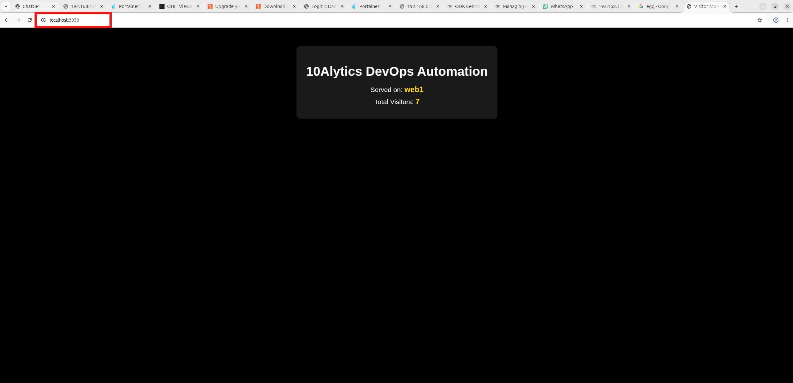

# Production-Ready DevOps Pipeline Using GitHub Actions and Terraform on AWS

Project Architecture (Pre-requisites)

We will use:

- App: Node.js

- Git (installed on your local machine) & GitHub (setup an account)

- CI/CD: GitHub Actions

- Cloud: AWS

- IaC: Terraform

- Compute: EC2, IAM least privilege

- Database

- Containerization: Docker

- Deployment: Docker on EC2


### Project structure:

```
tree
.
├── LICENSE
├── README.md
├── docker-compose.yml
├── nginx
│   ├── Dockerfile
│   └── nginx.conf
├── terra-config
│   ├── main.tf
└── app
    ├── Dockerfile
    ├── package-lock.json
    ├── package.json
    └── server.js
```

## Application Definition

The application would serve a purpose of an visit monitor web application built using Node.js, Nginx proxy and Redis database

The project originally comes from Docker’s official dockersamples collection: https://github.com/dockersamples/nginx-node-redis. 

It’s a simple Node.js + Redis request visitor monitor application with an NGINX load balancer. 

Every time you refresh the page, the visitor monitor  app increments and you also see the hostname as (web_app_1 or web_app_2) that served your request.

## Added Modification to the project

1. Github Actions Workflow for CI/CD Automation (.github/workflows/main.yaml)

1. Terraform configuration (terra-config/) to be usd to deploy the application on AWS cloud provider.

## Deployment Overview / Technical Implementation Summary

### Application Layer (web/server.js)

1. Developed a lightweight Node.js application integrated with Redis (running on port 6379).

1. The application dynamically:

    - Tracks and increments the number of visits with each page refresh.

    - Displays the hostname (web1 or web2) handling the request.

1. The service is exposed on port 5000.

1. Implemented UI modifications to enhance user interaction and clarity.

### NGINX Configuration (nginx/nginx.conf)

1. Designed a custom NGINX configuration file.

2. Configured an upstream load balancer targeting:

```    
    web1:5000
    web2:5000
```

3. Implemented proxy pass rules to ensure even distribution of incoming traffic across application instances.

4. Built a Dockerfile to replace the default NGINX configuration with the custom load balancing setup.

### Container Orchestration (docker-compose.yml)

1. Orchestrated the multi-container architecture using Docker Compose, including:

    - Database layer (a redis container).

    - Two Node.js application containers (web1 and web2).

    - An NGINX container acting as a reverse proxy and load balancer.

This setup demonstrates practical implementation of containerization, reverse proxy configuration, and load balancing within a microservices-based environment.


## Testing and validating on local host machine before AWS deployment

- validate the application runs locally before deployment on AWS cloud provider

[docker-compose.yaml](https://github.com/dockersamples/nginx-node-redis/blob/main/compose.yml)

```
services:
  redis:
    image: redis
    ports:
      - '6379:6379'
  web1:
    restart: on-failure
    build: ./web
    hostname: web1
    ports:
      - '81:5000'
  web2:
    restart: on-failure
    build: ./web
    hostname: web2
    ports:
      - '82:5000'
  nginx:
    build: ./nginx
    ports:
    - '80:80'
    depends_on:
    - web1
    - web2
```

The compose file defines an application with four services redis, nginx, web1 and web2. When deploying the application, Docker compose maps port 80 of the nginx service container to port 80 of the host as specified in the file. Redis runs on port 6379 by default.

Note

    - Make sure port 6379 on the host is not being used by another container, otherwise the port should be changed.
    - incase port 80 is assigned kindly chnage any desired port map to port 80 as seen below:
 ```
  nginx:
    build: ./nginx
    ports:
    - '5050:80'           
```


- change directory (cd) into the task directory where all resources are created/stored and execute the command below:

```
    docker compose up --build
```

output:


the output does the following

- It startup all containers required orderly
- It build docker images (Node.js, Nginx, Redis, and web app ) 
- Application is exposed through nginx (port 80)

Terminal message: 

```
    Web application is listening on port 5000
```
#### Outcome
Listing containers must show three containers running and the port mapping as below:

```
docker compose ps
```

Application can be accessed on the browser

```
http://localhost:80
```

output:




### NOTE
- Every time a visitor refresh the page, the visitor monitor will increase by +1

- The hostname will change between web_app_1 and web_app_2, showing that load balancing is working perfectly

- This clearly shows its works 100% on our local environment


## GitHub Actions And Terraform Integration With AWS

### AWS cloud Provider

## Set Up AWS CLI and IAM User

Before Terraform can communicate to AWS and spin up resources, we need to set up the AWS CLI and create an IAM user with the right permissions. step-by-step approach.

#### CREATE AN IAM USER

1. Log in to AWS account as the root user (the one you used to sign up).


2. In the AWS Management Console, navigate to IAM > Users and click on “Create User”.


Generate a username like "DevOps-Integrator" works great and click Next.

On the Set Permissions page, attach the policy named AdministratorAccess.


### NOTE
We’re giving full admin access here just to avoid permission issues during learning and experimentation, but dedicated privileges could be assigned based on RBAC/least privilege. Never use this approach in production.


### Generate Access Keys and Configure AWS CLI
1. Go back to the IAM dashboard and click on your new user: "DevOps-Integrator".

2. Under the Security Credentials tab, click on Create Access Key.


3. select Command Line Interface (CLI) as the use case, agree to the terms, and proceed


3. Once the keys are generated, copy the Access Key ID and Secret Access Key (Paste in a secured storage and use when demanded!).


Install AWS CLI (Ubuntu/Linux)
For Ubuntu (amd64), install the AWS CLI by running the commands in the terminal:

```
curl "https://awscli.amazonaws.com/awscli-exe-linux-x86_64.zip" -o "awscliv2.zip"
sudo apt install unzip -y
unzip awscliv2.zip
sudo ./aws/install
```

Using a different Operating System (OS), look into the official documentation: https://docs.aws.amazon.com/cli/latest/userguide/getting-started-install.html

Navigate to the terminal and configure the AWS CLI:
Insert

```
    aws configure
```

It will prompt you to enter:

- Access Key ID

- Secret Access Key

- Default region name: You can use us-east-1 for the purpose of the demo

Default output format: Enter json or yaml


## Terraform installation and Set Up 

### Terraform Installation on Ubuntu (amd64)
1. If you're using Ubuntu on an amd64 system, follow these commands to install Terraform:

```
sudo apt-get update && sudo apt-get install -y gnupg software-properties-common

wget -O- https://apt.releases.hashicorp.com/gpg | \
gpg --dearmor | \
sudo tee /usr/share/keyrings/hashicorp-archive-keyring.gpg > /dev/null

echo "deb [arch=$(dpkg --print-architecture) signed-by=/usr/share/keyrings/hashicorp-archive-keyring.gpg] \
https://apt.releases.hashicorp.com $(grep -oP '(?<=UBUNTU_CODENAME=).*' /etc/os-release || lsb_release -cs) main" | \
sudo tee /etc/apt/sources.list.d/hashicorp.list

sudo apt update
sudo apt-get install terraform
```
on a different operating system or architecture, follow the official installation guide here: https://developer.hashicorp.com/terraform/tutorials/aws-get-started/install-cli

2. After this, you can verify the installation with:

```
    terraform -v
```

since AWS CLI has been configured, Terraform will automatically use the credentials (access key & secret key) stored by aws configure. 

Which means everything is ready to provision AWS resources seamlessly and securely. 

## Terraform Configuration
Inside the terra-config/main.tf file:

- Make use of default VPC

- retrieve the latest Ubuntu AMI

- Creates a Security Group with port 22 (for SSH) and port 80 (HTTP) open

- Make use of t2.micro EC2 instance that make use of SG and AMI

- Include user-data script that installs Docker, Docker Compose, and runs our app on the instance

Note: Terraform handles all infrastructure creation and boots/load up the EC2 instance that runs our visitor monitor app.

### GitHub Actions Workflow

1. Add the following Repository Secrets (from the IAM user that was created earlier):

    - AWS_ACCESS_KEY_ID

    - AWS_SECRET_ACCESS_KEY 

2. The .github/workflows/main.yml pipeline is triggered on pull/push requests. 
The following takes place

    - Checkout the repository

    - Setup Terraform

    - Execute terraform init, terraform validate, terraform plan

    - It Applies infrastructure with terraform apply

    - Waiting time (few seconds): allows user-data to finish setting up Docker + app

    - Get the Public IP of the EC2 instance

    - app runs for 5 minutes

    - Auto shut-down/delete with terraform destroy: ensures no unused AWS resources are left behind to avoid cost

3. Trigger Workflow (commit and push changes):

```
    git status
    git add terra-config/main.tf
    git commit -m "Updated GitHub repo URL"
    git push origin main
```

The push will trigger the GitHub Actions workflow automatically deploying the app to AWS cloud provider.

Output: 


3. Testing the Deployment on AWS
Once everything is set up, it’s time to watch the result.

    - Navigate to GitHub Repository Dashboard

    - Click on Actions


Find your recent commit – for example:

Access the workflow run: pay attention to the terraform job executing step by step.

Wait until the workflow reaches the “Keep App Running Stage”. 

At this point, Terraform has already created your EC2 instance, installed Docker & Docker Compose, and run the application.


Click on the Public URL as seen in the logs to access the application

The visitor monitor app is now live via AWS EC2 instance.

-   The application is executed for 2 minutes

-   Every refresh increments the visitor monitor app

Requests are distributed between web_app_1 and web_app_2 via the Nginx load balancer


4. After 5 minutes, GitHub Actions will automatically run terraform destroy to clean up resources and avoid unnecessary AWS charges 


## Real-Life Scenario: Updating Your App on the Fly
Now that our app is live, let’s simulate a real production change.

Imagine your manager says:

"Hey, can you update the heading from Welcome to Request Counter to Welcome to My Amazing Request Counter?"

Here’s how simple it becomes with GitHub Actions + Terraform:

Open the web/server.js file in your project

Find the <h1> HTML tag and update it:

 <h1>Welcome to My Amazing Request Counter</h1>

 Push the changes to your repository:

```
 git status
 git add web/server.js
 git commit -m "Heading Changed"
 git push origin main

 ```


 That’s it! GitHub Actions will pick up the changes, trigger the workflow, and within 5 minutes your updated heading will be live on the EC2 instance.


 This is the true power of CI/CD pipelines — no manual SSH into servers, no redeploying by hand. Just push your code and let Terraform + GitHub Actions handle the rest 🚀.


🏁 Conclusion
In this blog, we took a simple Node.js + Redis counter application and supercharged it with Nginx, Docker, Terraform, and GitHub Actions.

What started as a local demo quickly transformed into a cloud-ready, automated CI/CD pipeline:

🚀 Docker + Docker Compose handled local testing and containerization

⚡ Terraform provisioned AWS infrastructure seamlessly

🔄 GitHub Actions automated deployments and teardown, giving us a clean, cost-effective workflow

🎯 And most importantly — we saw how easy it is to make real-time changes that go live with just a git push.

This project proves how infrastructure as code + automation can save developers hours of repetitive work and make production-ready workflows more reliable.

Thanks for following along — I hope this inspires you to build your own Terraform + GitHub Actions pipelines!